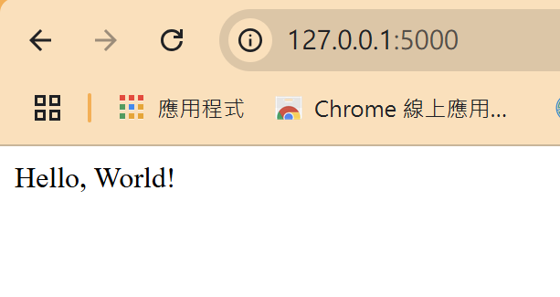
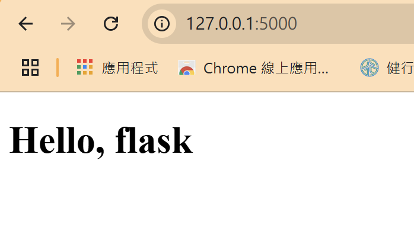
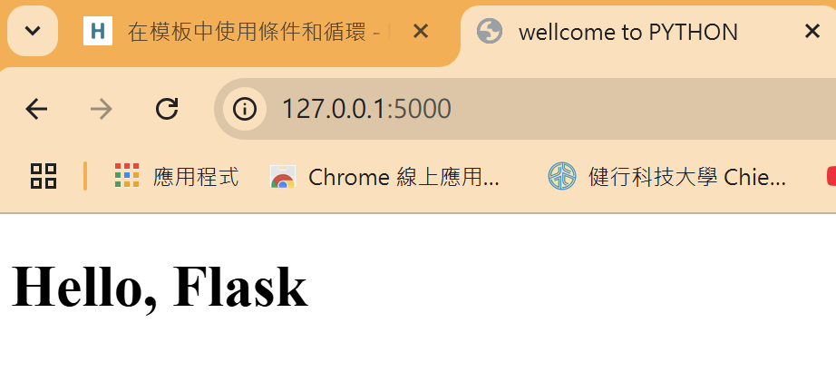
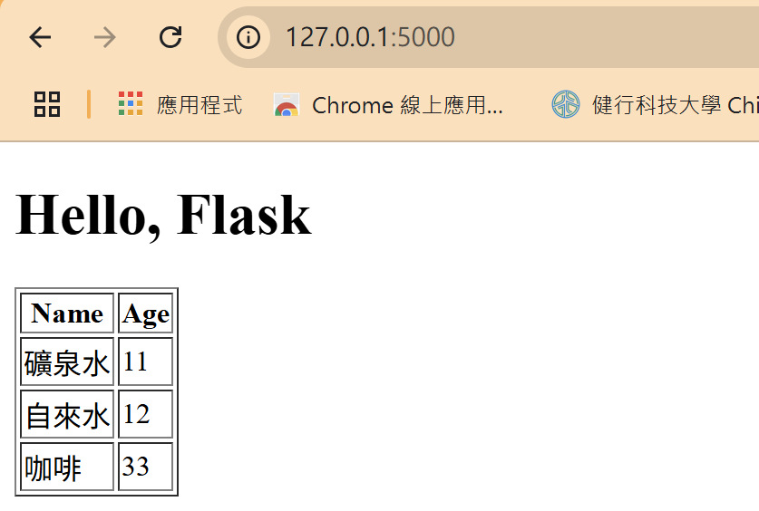

# Flask 基礎語法
>[!NOTE]
>Flask 是屬於輕量化的Python網頁框架，並且具有極佳的延展性，Flask是利用Werkzeug與Jinja 2實現的網頁框架。

>[!NOTE]
>Welcome to Flask’s documentation. Flask is a lightweight WSGI web application framework. It is designed to make getting started quick and easy, with the ability to scale up to complex applications.


- Flask document : https://flask.palletsprojects.com/en/stable/
## Flask 安裝
```
pip3 install flask
```
## 用Flask顯示Hello World
>[!NOTE]
>Flask的Hello World主要是用網頁的方式呈現，並且可以用html的方式顯示

``` python
from flask import Flask
app = Flask(__name__)

@app.route("/")
def hello_world():
    return "Hello, World!"
```
```
flask run
```

## Flask和HTML Template
>[!NOTE]
>利用Template搭配Jinjia語法，可以比較有效的撰寫html檔案。
### 基礎程式碼
>[!NOTE]
>利用剛剛的Hello World，確認程式碼是可以動的。

``` python
from flask import Flask

app = Flask(__name__)

@app.route("/")
def hello_world():
    return "Hello, World!"

if __name__=="__main__":
    app.run(host='0.0.0.0')
```
建立templates資料夾，並在裡面寫入index.html
``` html
<!DOCTYPE html>
<html lang="en">
<head>
    <meta charset="UTF-8">
    <meta name="viewport" content="width=device-width, initial-scale=1.0">
    <title>flask</title>
</head>
<body>
    <h1>Hello</h1>
</body>
</html>
```
### 利用Template顯示變數
>[!NOTE]
>可以利用Flask路由控制Jinjia的變數

利用Flask的`render_template`顯示html檔案。
``` python
from flask import Flask
from flask import render_template
app = Flask(__name__)

@app.route("/")
def hello():
    name = 'flask'
    return render_template('index.html', name=name)

if __name__=="__main__":
    app.run(host='0.0.0.0')
```
修改index.html檔案，把 Jinjia的template加入`{{ name }}`。
``` html
<!DOCTYPE html>
<html lang="en">
<head>
    <meta charset="UTF-8">
    <meta name="viewport" content="width=device-width, initial-scale=1.0">
    <title>flask</title>
</head>
<body>
    <h1>Hello, {{ name }}</h1>
</body>
</html>
```

### 利用Template執行條件式
>[!NOTE]
>Jinjia的語法也可以做的到`if else`的功能

Jinjia的`if else`語法
``` 

	something...    

    something...

```

``` python
from flask import Flask
from flask import render_template
app = Flask(__name__)

@app.route("/")
def hello():
    name = {'username': 'Flask'}
    return render_template('index.html', name=name, title='PYTHON')

if __name__=="__main__":
    app.run(host='0.0.0.0')
```
當有設定`title`這個變數的時候，就會顯示`title`變數的值，如果沒有就顯示`wellcome to python`
``` html
<!DOCTYPE html>
<html lang="en">
<head>
    <meta charset="UTF-8">
    <meta name="viewport" content="width=device-width, initial-scale=1.0">
    
    <title>wellcome to {{ title }}</title>
    
    <title>wellcome to python</title>
    
</head>
<body>
    <h1>Hello, {{ name.username }}</h1>
</body>
</html>
```

### 利用Template執行迴圈
>[!NOTE]
>Jinjia的語法也可以做的到`for loop`的功能

Jinjia的`for loop`語法
```

	{{ data.1 }}
    {{ data.2 }}

```

``` python
from flask import Flask
from flask import render_template
app = Flask(__name__)

@app.route("/")
def hello():
    name = {'username': 'Flask'}
    rows = [
        {'name':'礦泉水', 'age':11},
        {'name':'自來水', 'age':12},
        {'name':'咖啡', 'age':33}
    ]
    return render_template('index.html', name=name, title='PYTHON', rows=rows)

if __name__=="__main__":
    app.run(host='0.0.0.0')
```

``` html
<!DOCTYPE html>
<html lang="en">
<head>
    <meta charset="UTF-8">
    <meta name="viewport" content="width=device-width, initial-scale=1.0">
    
    <title>wellcome to {{ title }}</title>
    
    <title>wellcome to python</title>
    
</head>
<body>
    <h1>Hello, {{ name.username }}</h1>

    <table border="1">
        <thead>
            <tr>
                <th>Name</th>
                <th>Age</th>
            </tr>
        </thead>
        <tbody>
            
            <tr>
                <td>{{ row.name }}</td>
                <td>{{ row.age }}</td>
            </tr>
            
        </tbody>
    </table>
</body>
</html>
```


### Template繼承
>[!NOTE]
>當有重複的html程式碼，可以使用Template來避免重複寫code

- base.html
``` html
<!DOCTYPE html>
<html lang="en">
<head>
    <meta charset="UTF-8">
    <meta name="viewport" content="width=device-width, initial-scale=1.0">
    
    <title>wellcome to {{ title }}</title>
    
    <title>wellcome to python</title>
    
</head>
<body>
    <div>Twitter: <a href="/">Home</a></div>
    <hr>
     
    
</body>
```
- index.html
``` html


    <h1>Hello, {{ name.username }}</h1>
    
    <div><p>{{ post.author.username}} says: <b>{{ post.body }}</b></p></div>
    

```


