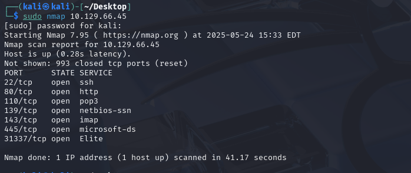
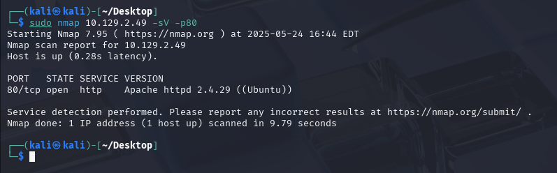

>[!NOTE]
nmap 是一種免費且開源的系統及網路掃描工具，他除了在滲透測試裡面擔任網路網路偵蒐的任務，也常被網路管理人員作為network inventory, managing service upgrade schedules的工具。

https://nmap.org/?source=post_page-----36ed094d6ef8---------------------------------------

- Nmap 使用範圍
	- Host discovery
	- Port scanning
	- Service enumeration and detection
	- OS detection
	- Scriptable interaction with the target service (Nmap Scripting Engine)

# 存活主機探索(Host Discovery)
>[!NTOE]
>當需要在某個子網的範圍內，搜索有開機的主機的時候，或是說探索這個子網內部有哪些主機時，可以用nmap的host discovery來做探索。

## 掃描整個子網
假設子網的ip是`192.168.1.0/24`，可以這樣執行。
```
nmap 192.168.1.0 -sn
```
- -sn : 關閉port scanning

如果需要彙整成清單的話，可以利用這個功能
```
nmap 192.168.1.0 -sn -oA tnet | grep for | cut -d" " -f5
```
- oA : 輸出成tnet格式
## 使用ip清單
>[!NOTE]
>假設手上有一個ip的清單，想要快速掌握那些ip位置有存活

- ip.txt
```
192.168.1.12
192.168.1.24
192.168.1.33
192.168.1.34
192.168.1.55
192.168.1.34
```

可以利用這樣的指令做掃描，來取得主機存活資訊
```
sudo nmap -sn -oA tnet -iL hosts.lst
```
## 同時掃描多個ip位置
```
nmap -sn -oA tnet 10.129.2.18 10.129.2.19 10.129.2.20| grep for | cut -d" " -f5
```

# 服務掃描
>[!NOTE]
>在系統攻擊前，需要先知道目標在執行那些服務，只知道ip是不夠的，所以我們需要利用一些工具來進行目標的列舉。
- Nmap主要可以刺探下列資訊
	- Open ports and its services
	- Service versions
	- Information that the services provided
	- Operating system

Nmap對於目標的掃描結果有幾個state:

| **State**          | **Description**                                                                                                                                                                                         |
| ------------------ | ------------------------------------------------------------------------------------------------------------------------------------------------------------------------------------------------------- |
| `open`             | This indicates that the connection to the scanned port has been established. These connections can be **TCP connections**, **UDP datagrams** as well as **SCTP associations**.                          |
| `closed`           | When the port is shown as closed, the TCP protocol indicates that the packet we received back contains an `RST` flag. This scanning method can also be used to determine if our target is alive or not. |
| `filtered`         | Nmap cannot correctly identify whether the scanned port is open or closed because either no response is returned from the target for the port or we get an error code from the target.                  |
| `unfiltered`       | This state of a port only occurs during the **TCP-ACK** scan and means that the port is accessible, but it cannot be determined whether it is open or closed.                                           |
| `open\|filtered`   | If we do not get a response for a specific port, `Nmap` will set it to that state. This indicates that a firewall or packet filter may protect the port.                                                |
| `closed\|filtered` | This state only occurs in the **IP ID idle** scans and indicates that it was impossible to determine if the scanned port is closed or filtered by a firewall.                                           |
## 掃描TCP服務
>[!NOTE]
>利用Nmap掃描TCP port是最常見的用法，利用Nmap可以很快的發現主機使用的服務以及有開啟的port，以利後續的滲透。

Nmap預設會做1000個最常見的TCP port，並且使用SYN Scan
```
nmap 10.129.66.45
```



可以利用參數做調整，使用`--top-ports`可以調整常用的port
``` 
 nmap 10.129.66.45 --top-ports=10 
```


可以顯示Nmap顯示送出跟送回的封包
```
nmap 10.129.2.28 -p22,80,110 --packet-trace --disable-arp-ping -Pn -n --reason -sT
```


Nmap的TCP常見使用指令:
- 常用的掃描指令
```
nmap -sS -p- -T4 192.168.100.1
```
- Nmap掃描 Full-scan
```
nmap -p- 192.168.50.149
```
- 針對port位掃描
```
nmap -sC -sV -p80,135,445 192.168.100.1
```
- SYN-Scan
```
nmap -sS 192.168.50.149
```
- TCP-Scan
```
nmap -sT 192.168.50.149
```
## 掃描UDP服務
>[!NOTE]
>相比TCP，UDP能做探刺到的資料就比較少，畢竟UDP是stateless protocol，而且UDP掃描的時間也會比較長。

使用Nmap做 UDP掃描
```
sudo nmap 10.129.2.28 -F -sU
```
- -F : 掃描常見的100個port
- -sU : UDP Scan

## 掃描服務版本
>[!NOTE]
>可用於探刺服務的版本，比如說探刺80port的apache版本。

```
sudo nmap 10.129.2.49 -sV -p80
```
 
# 使用Nmap腳本
>[!NOTE]
>Nmap Scripting Engine (NSE) 是Nmap的一個亮眼的功能，NSE是用Lua轉寫的掃描腳本，可以用於各種不同的情境。

Nmap大約內建14種不同的NSE掃描腳本

| **Category** | **Description**                                                                                                                         |
| ------------ | --------------------------------------------------------------------------------------------------------------------------------------- |
| `auth`       | Determination of authentication credentials.                                                                                            |
| `broadcast`  | Scripts, which are used for host discovery by broadcasting and the discovered hosts, can be automatically added to the remaining scans. |
| `brute`      | Executes scripts that try to log in to the respective service by brute-forcing with credentials.                                        |
| `default`    | Default scripts executed by using the `-sC` option.                                                                                     |
| `discovery`  | Evaluation of accessible services.                                                                                                      |
| `dos`        | These scripts are used to check services for denial of service vulnerabilities and are used less as it harms the services.              |
| `exploit`    | This category of scripts tries to exploit known vulnerabilities for the scanned port.                                                   |
| `external`   | Scripts that use external services for further processing.                                                                              |
| `fuzzer`     | This uses scripts to identify vulnerabilities and unexpected packet handling by sending different fields, which can take much time.     |
| `intrusive`  | Intrusive scripts that could negatively affect the target system.                                                                       |
| `malware`    | Checks if some malware infects the target system.                                                                                       |
| `safe`       | Defensive scripts that do not perform intrusive and destructive access.                                                                 |
| `version`    | Extension for service detection.                                                                                                        |
| `vuln`       | Identification of specific vulnerabilities.                                                                                             |
使用Nmap NSE的方式如下
- 預設模式
```
nmap <target> -sC
```
- 指定腳本模式
```
nmap <target> --script <category>
```
- 多腳本模式
```
nmap <target> --script <script-name>,<script-name>,...
```
- 大絕招模式(使用 -sC -sV -O --traceroute)
```
nmap <target> -p 80 -A
```


