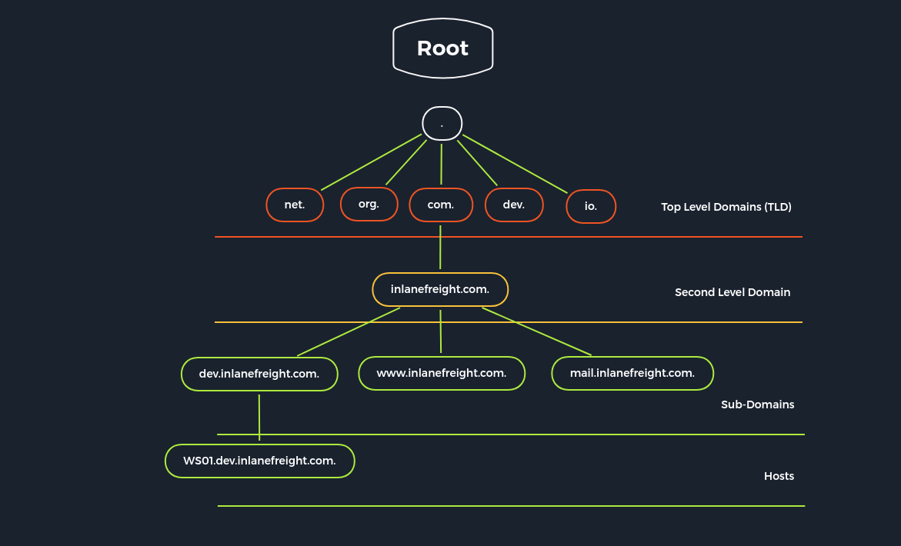

# 服務列舉
>[!Note]
>當確認某個port有開啟後，就需要對該port所執行的服務做列舉，本章將針對不同的網路服務的列舉手法做說明。
## DNS列舉
>[!NOTE]
>DNS是將網址轉換成IP的一個協議，這個協議採用層次結構將各個區塊化成不同的Zone，並從top-domain開始由上往下，且並沒有中央控管的機制
### DNS介紹
DNS是由多種不同身分的腳色所組成的，他主要有以下幾種身分
- DNS root server : 屬於 top-level domains (`TLD`)，也就是整個網際網路中 **域名系統（DNS）** 的最高層級伺服器，用來協助解析網址到實際的 IP 位址。簡單來說，它是 DNS 查詢過程的「起點」，目前 DNS root server由(`ICANN`)管理，並且全球共有13個。
- Authoritative name server : （授權名稱伺服器）是 DNS 系統中的一個關鍵角色，它**擁有並提供某個網域名稱的最終、正確答案**。當 DNS 查詢最終抵達該伺服器時，它會回應該網域的實際記錄（例如 A、MX、TXT 等），可以把它當成網址與ip位置儲存的真正的伺服器。
- Non-authoritative name server : （**非授權名稱伺服器**）是 DNS 系統中能夠提供某個網域查詢結果的伺服器，但**它不是該網域的原始來源**，而是從其他伺服器取得資料後，**暫時快取（cache）這些結果**來回應查詢。
- Caching server : （快取 DNS 伺服器）是一種 **儲存其他伺服器查詢結果** 的 DNS 伺服器，用來加速 DNS 查詢、減少頻繁的查詢量，並提高整體解析效率。
- Forwarding server : **Forwarding DNS Server** 是一種設定為**把所有 DNS 查詢轉送給另一台指定 DNS 伺服器**的 DNS server，它**不會自己遞迴查詢 root、TLD、authoritative server**，而是把查詢交給上游 DNS resolver 處理，主要用於公司內部的DNS Server
- Resolver :  是負責**遞迴查詢 DNS 記錄**的伺服器，最終找到正確答案（可能來自快取或詢問授權伺服器），嚴格來說並不是DNS 伺服器。

DNS 查詢的流程圖
```
Client → Forwarding DNS Server → Upstream Resolver（如 8.8.8.8）→ 正規 DNS 查詢鏈
```
### DNS架構


- **A 紀錄（Address Record）**：  
    包含該網域的 **IPv4 位址**，讓瀏覽器知道要連到哪一台主機。
- **MX 紀錄（Mail Exchange）**：  
    指定用來 **處理該網域電子郵件的郵件伺服器**，常見於設定企業信箱。
- **CNAME 紀錄（Canonical Name）**：  
    用來設定 **子網域的別名指向另一個網域名稱**，例如讓 `blog.example.com` 指向 `example.com`。
- **NS 紀錄（Name Server）**：  
    指出 **負責該網域的授權名稱伺服器**，是 DNS 系統中重要的控制點之一。
- **SOA 紀錄（Start of Authority）**：  
    包含關於網域的重要資訊，例如 **主要名稱伺服器、最後更新時間、負責人資訊等**，是每個 DNS 區域檔的起點。
- **PTR 紀錄（Pointer Record）**：  
    將 **IPv4 位址對應回主機名稱**，稱為「反向 DNS 紀錄」，常見於電子郵件伺服器驗證。
- **TXT 紀錄（Text Record）**：  
    可由管理員加入 **任意文字資訊**，常用於 **SPF、DKIM、DMARC** 等郵件驗證設定，或是提供其他說明資訊。

### DNS列舉


### DNS 爆破


## FTP
## SMB
## NFS

## SMTP

## SNMP


## Reference
1. Footprinting : https://academy.hackthebox.com/module/details/112